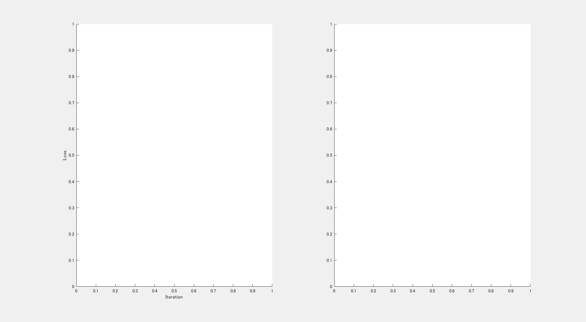
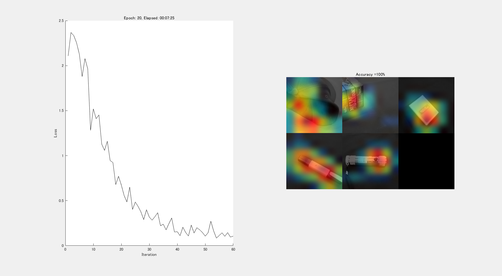

# Continuous CAM Generation during the Training Process using Custom Training Loop 


This demo shows how to continuously creat a class activation mapping (CAM) during the traing process with a custom learning rate schedule.


Automatic differentiation enables you to customize CNN as you want. This example trains a network to classify data and simulteniously compute the CAM (Class Activation Mapping) of the validation data with the weights during the training. 


This demo can visualize how the CNNs get to focus on the region in the image to classify which leads to the reability of the network and helps a lot in education of CNNs. Further, if the CNN is over-tuned to the dataset, the process also can be visualized. 


The class activation mapping was done referring to the paper below. 


Zhou, Bolei, Aditya Khosla, Agata Lapedriza, Aude Oliva, and Antonio Torralba. "Learning deep features for discriminative localization." In *Proceedings of the IEEE Conference on Computer Vision and Pattern Recognition*, pp. 2921-2929. 2016.


This demo using the custom training loop was made with the official document below.


[https://jp.mathworks.com/help/deeplearning/ug/train-network-using-custom-training-loop.html](https://jp.mathworks.com/help/deeplearning/ug/train-network-using-custom-training-loop.html)


# Prepare for the data and pre-trained network

   -  This example uses a dataset called Mathworks Merchandice  
   -  This is a small data set containing 75 images of MathWorks merchandise, belonging to five different classes (*cap*, *cube*, *playing cards*, *screwdriver*, and *torch*).  
   -  The dataset is already installed as long as you have instralled Deep Learning Toolbox.  
   -  If you would like to do this example with other datasets, please refer to this page, which lists the datasets you can easily use with Matlab.  
   -  ([https://jp.mathworks.com/help/deeplearning/ug/data-sets-for-deep-learning.html](https://jp.mathworks.com/help/deeplearning/ug/data-sets-for-deep-learning.html)) 

```matlab
clear;clc;close all
if exist("MerchData")~=7
str=which("MerchData.zip")
copyfile(str,pwd)
unzip("MerchData")
end
```
# Load Training Data into image datastore


Use `imagedatastore` to list up images to use


```matlab
imds = imageDatastore('MerchData','IncludeSubfolders',true, 'LabelSource','foldernames');
netName='resnet18';
net=eval(netName);
imgSize=net.Layers(1,1).InputSize;
[imdsTrain,imdsValidation] = splitEachLabel(imds,0.9,'randomized');
% readAndPreproc is a helper function to resize the input image so that the
% images can be fed into the pre-trained network
imdsTrain.ReadFcn = @(filename) readAndPreproc(filename,imgSize);
imdsValidation.ReadFcn = @(filename) readAndPreproc(filename,imgSize);
% To read all training images into 4D image where each dimension
% corresponds to height, width, RGB channel and number of images.  
XTrainCell=readall(imdsTrain);
% The variable read by readall function is in cell type, then the variable
% was let go went through the function cat to convert into double type.  
XTrain=cat(4,XTrainCell{:});
% Ytrain represents the labels of the training images
YTrain=imdsTrain.Labels;
XValidationCell=readall(imdsValidation);
XValidation=cat(4,XValidationCell{:});
YValidation=imdsValidation.Labels;
classes = categories(YTrain);
numClasses = numel(classes);
```
# Define Network


Define the network and specify the average image using the `'Mean'` option in the image input layer.


Create a `dlnetwork` object from the layer graph.


If you run this demo with other pre-trained network, an error will be returned because the layer name to refer should be changed at each pre-trained network. 


```matlab
lgraph = layerGraph(net);
lgraph = replaceLayer(lgraph,'fc1000',fullyConnectedLayer(numClasses, 'Name', 'fc'));
lgraph = removeLayers(lgraph,'prob');
lgraph = removeLayers(lgraph,'ClassificationLayer_predictions');
dlnet = dlnetwork(lgraph);
```
# Specify Training Options


Specify the training options. 


```matlab
velocity = [];
numEpochs = 20;
miniBatchSize = 20;
numObservations = numel(YTrain);
numIterationsPerEpoch = floor(numObservations./miniBatchSize);
initialLearnRate = 0.0001;
momentum = 0.9;
decay = 0.01;
```


Train on a GPU if one is available. Using a GPU requires Parallel Computing Toolbox™ and a CUDA® enabled NVIDIA® GPU with compute capability 3.0 or higher. You can check if your GPU is qualified for that. 


[https://developer.nvidia.com/cuda-gpus](https://developer.nvidia.com/cuda-gpus)


Note that if your GPU is very brand-new, maybe your GPU is not ready to use with this demo.  


```matlab
executionEnvironment = "auto";
```
# Prepare the figure to plot 


Initialize the training progress plot to display the training process at the end of each iteration. 


```matlab
f=figure;
set(gcf,'Visible','on')
f.WindowState='maximized'; % maximize the figure to show the CAM and training process
% use subplot function to plot both the training process and the class
% activation mas 
f1=subplot(1,2,1);
% aniimatedline enables to create an animation by adding points to the line in a loop using the addpoints function.
lineLossTrain = animatedline;
xlabel("Iteration")
ylabel("Loss")
f2=subplot(1,2,2);
```



  
```matlab
iteration = 0;
% Convert the data to dlarray objects with underlying type single and specify the dimension labels 'SSCB' (spatial, spatial, channel, batch).
dlXVal=dlarray(single(XValidation),'SSCB');
% the variable layerName represents the layer to which convolutional
% operation was made
layerName = activationLayerName(netName);
% the indices shows the index of the class of the image
% for example, the classes are composed of three classes which are
% dog, cat and bird and if the i-th image belongs to bird, the
% indices(i) will be 3. 
% this value is used for calculating CAM with the helper function GenerateCAM
indices=arrayfun(@(x) find(x==classes), YValidation);
```
# Train Model


Train the model using a custom training loop.


```matlab
% Loop over epochs.
start = tic;
for epoch = 1:numEpochs
    % For each epoch, shuffle the data and loop over mini-batches of data.
    % this line is responsible for shuffling data. the function randperm
    % returns the random index to collect the training images
    idx = randperm(numel(YTrain));
    % get XTrain based on the idx. the idx is, for example, [2 3 4 1 5] if
    % the number of training image is 5. The XTrain is rearranged with the
    % vector, meaning the XTrain and YTrain is shuffled. 
    XTrain = XTrain(:,:,:,idx);
    % YTrain is the labels of the XTrain like Cube and Cap. 
    YTrain = YTrain(idx);
    
    % Loop over mini-batches.
    for i = 1:numIterationsPerEpoch
        iteration = iteration + 1;
        
        % Read mini-batch of data and convert the labels to dummy
        % variables. One-hot vector was made to train the network
        idx = (i-1)*miniBatchSize+1:i*miniBatchSize;
        X = XTrain(:,:,:,idx);        
        Y = zeros(numClasses, miniBatchSize, 'single');
        % one-hot vector is created here
        % for example, the classes are composed of three classes which are
        % dog, cat and bird and if the n-th image belongs to bird, the
        % vector named Y will be [0 0 1]. 
        for c = 1:numClasses
            Y(c,YTrain(idx)==classes(c)) = 1;
        end
        
        % Convert mini-batch of data to dlarray.
        dlX = dlarray(single(X),'SSCB');
        
        % If training on a GPU, then convert data to gpuArray.
        if (executionEnvironment == "auto" && canUseGPU) || executionEnvironment == "gpu"
            dlX = gpuArray(dlX);
        end
        
        % Evaluate the model gradients and loss using dlfeval and the
        % modelGradients function.
        [gradients,loss] = dlfeval(@modelGradients,dlnet,dlX,Y);
        
        % Determine learning rate for time-based decay learning rate schedule.
        learnRate = initialLearnRate/(1 + decay*iteration);
        
        % Update the network parameters using the SGDM optimizer.
        % The optimizer Adam might be better 
        % please try other optimizer if the performance with your data is
        % not preferable 
        [dlnet.Learnables, velocity] = sgdmupdate(dlnet.Learnables, gradients, velocity, learnRate, momentum);
        
        % Display the training progress.
        D = duration(0,0,toc(start),'Format','hh:mm:ss');
        addpoints(lineLossTrain,iteration,double(gather(extractdata(loss))))
        f1.Title.String=["Epoch: " + epoch + ", Elapsed: " + string(D)];
        subplot(1,2,2)
        CAMcollected=GenerateCAM(dlXVal,dlnet,layerName,indices);
        montage(CAMcollected);drawnow
        dlYPred = forward(dlnet,dlXVal);
        dlYPred = softmax(dlYPred);
        [~,idx] = max(extractdata(dlYPred),[],1);
        YPred = classes(idx);
```


Evaluate the classification accuracy with the validation data.  


```matlab
        accuracy = mean(YPred==YValidation);
        f2.Title.String=strcat("Accuracy =",num2str(accuracy*100), "%");hold on
        F{iteration}=getframe(gcf);
    end
end
```



# Test Model


This demo simply tests the model with the validation data. This section can be replaced by the function predict, however, to implement the inference process step by step helps you understand the system. 


```matlab
% A convolutional operation was done with the function forward 
dlYPred = forward(dlnet,dlXVal);
dlYPred = softmax(dlYPred);
[~,idx] = max(extractdata(dlYPred),[],1);
YPred = classes(idx);
```


Evaluate the classification accuracy. Here, a very high accuracy is returned just because the dataset to use is very small. 


```matlab
accuracy = mean(YPred==YValidation)
```
```
accuracy = 1
```
# Save the class activation maps into a GIF file


Save the series of the class activation maps and training process into GIF file. Please refer to the official document as below to learn more.


[https://jp.mathworks.com/help/matlab/ref/imwrite.html?lang=en](https://jp.mathworks.com/help/matlab/ref/imwrite.html?lang=en)


```matlab
filename = 'testAnimated.gif'; % Specify the output file name
for k=1:iteration
    frame=F{k};
    [A,map] = rgb2ind(frame.cdata,256);
    if k == 1
        imwrite(A,map,filename,'gif','LoopCount',Inf,'DelayTime',.1);
    else
        imwrite(A,map,filename,'gif','WriteMode','append','DelayTime',.1);
    end
end
```
# Let's consider the topics below as a next step

   -   Herein, class activation mapping (CAM) was created. As another visualization method, grad-cam as cited below is known which can be applied to wide variety of pre-trained networks such as AlexNet. 
   -  My assumption is that the grad-cam highlights a region which should be focused on in the next iteration, so that a dynamic change of the animation is difficult to be obtained, I did not try that, though.  
   -  Please try above if your time allows.  
   -  This demo was done with a small dataset, enabling you to try that easily. If you would like to explore this technique more, please do this with your dataset, too.  


Selvaraju, R. R., M. Cogswell, A. Das, R. Vedantam, D. Parikh, and D. Batra. "*Grad-CAM: Visual Explanations from Deep Networks via Gradient-Based Localization.*" In IEEE International Conference on Computer Vision (ICCV), 2017, pp. 618–626. Available at [`Grad-CAM`](http://openaccess.thecvf.com/content_ICCV_2017/papers/Selvaraju_Grad-CAM_Visual_Explanations_ICCV_2017_paper.pdf) on the Computer Vision Foundation Open Access website.  


# Model Gradients Function


The `modelGradients` function takes a `dlnetwork` object `dlnet`, a mini-batch of input data `dlX` with corresponding labels `Y` and returns the gradients of the loss with respect to the learnable parameters in `dlnet` and the corresponding loss. To compute the gradients automatically, use the `dlgradient` function.


```matlab
function [gradients,loss] = modelGradients(dlnet,dlX,Y)
% A convolutional operation was done with the function forward 
dlYPred = forward(dlnet,dlX);
% the result obtained was normalized with the function softmax as done in
% softmax layer
dlYPred = softmax(dlYPred);
% cross entropy loss was calculated with the function crossentropy
% if you would like the network to solve a regression problem, squared loss
% is used in many cases
loss = crossentropy(dlYPred,Y);
% the gradiant was calculated with the function dlgradient
gradients = dlgradient(loss,dlnet.Learnables);
end

% this function CAM collected creats class actimation maps where four
% inputs are required: 1) 
function CAMcollected = GenerateCAM(dlXVal,dlnet,layerName,indices)
    imsize=size(dlXVal(:,:,:,1));
    % convolutional operation was done just prior to the global average
    % layer. You have to specify the layer name to calculate this. 
    % this operation is similar to that with the function named activations 
    dlYPred = forward(dlnet,dlXVal,'Outputs',layerName);
    % The final layer in the dlnet is fully connected layer
    % The feature map prior to the global average pooling layer and the
    % weight in the fully connected layer are used to creat the CAM
    weightVector=dlnet.Layers(end, 1).Weights;
    Bias=dlnet.Layers(end, 1).Bias;
    for i=1:size(dlXVal,4)
    % the variable indices keeps the index of the class 
    % for instance, this demo contains five classes to classify, which are Cap, Cube, playing Cards, Screwdrive and Torch. 
    % if the label of the target image is Cube, the indices(i) returns 2. 
    % this value is used to retrieve the weights for calculating CAM
    idx=indices(i);
    % the weights to calculate the CAM can be obtained from the variable
    % weightVector as above. If the target image is "Cube", the weight to
    % use is the second weight vector since the "class index" is 2. 
    % the vector was reshaped so that the CAM can be calculated
    weightVectorReshaped=reshape(weightVector(idx,:),[1 1 numel(weightVector(idx,:))]);
    % the weighted feature maps with the weight value are summed up
    % throughout the channels 
    CAM=sum(dlYPred(:,:,:,idx).*weightVectorReshaped+Bias(idx),3);
    % the pixel values are normalized from 0 to 1 with the helper functio
    % as defined in the end of this live editor
    CAM = normalizeImage(extractdata(CAM));
    % The pixel value lower than a certain value was round off to zero
    % As the intensity of the activation is comparative, please tune this
    % value based on your objective and data
    CAM(CAM<0.2) = 0;
    % the map was color-coded to visualize 
    cmap = jet(255).*linspace(0,1,255)';
    CAM = ind2rgb(uint8(CAM*255),cmap)*255;
    % to layer the original image and its CAM, the pixel values of the
    % original image and CAM are summed up
    combinedImage = double(rgb2gray(uint8(extractdata(dlXVal(:,:,:,i)))))./2 + imresize(CAM,imsize(1:2));
    % to display the CAM with the function montage, the CAMs were placed in
    % a cell variable called CAMcollected
    CAMcollected{i} = uint8(normalizeImage(combinedImage)*255);
    end
end

% The helper functin normalizeImage convert the 
% The function normalize can replace the helper function as follows normalize(A,'range')
function N = normalizeImage(I)
minimum = min(I(:));
maximum = max(I(:));
N = (I-minimum)/(maximum-minimum);
end

% This helper function was prepared for the use with pre-trained networks
% rather than the resnet, it was not done, though. 
function layerName = activationLayerName(netName)
if netName == "squeezenet"
    layerName = 'relu_conv10';
elseif netName == "googlenet"
    layerName = 'inception_5b-output';
elseif netName == "resnet18"
    layerName = 'res5b_relu';
elseif netName == "mobilenetv2"
    layerName = 'out_relu';
end
end

%This function resizes the images to the proper size for the pre-trained
%network 
function Iout = readAndPreproc(inFilename,imgSize)
    % read the target image
    I = imread(inFilename);
    % resize into the input size for the pre-trained model
    Iout = imresize(I,[imgSize(1:2)]);  
end
```
